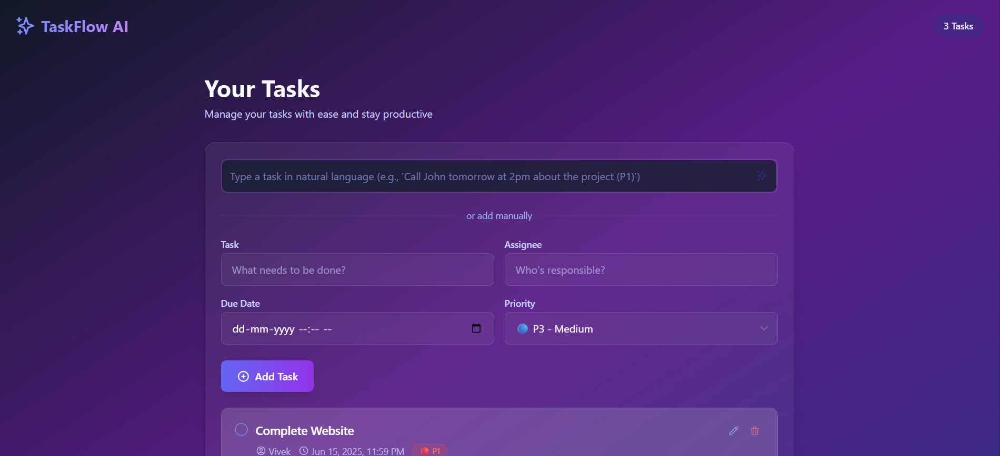
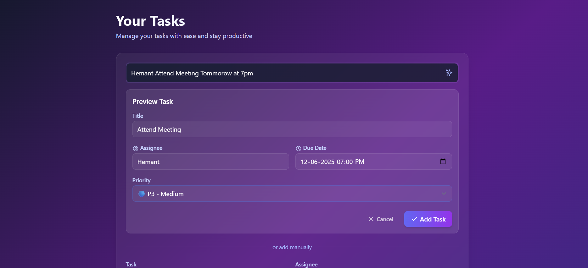

# 🚀 TaskFlow AI - Intelligent Task Manager


A modern, AI-powered task management application that helps you organize your work efficiently. Built with React, Tailwind CSS, and Google's Gemini AI.

## ✨ Features

- **AI-Powered Task Creation** - Add tasks using natural language (e.g., "Call John tomorrow at 2pm about the project")
- **Beautiful UI** - Sleek, dark-themed interface with smooth animations
- **Task Prioritization** - Categorize tasks by priority (P1-P4)
- **Due Dates** - Set and track task deadlines
- **Responsive Design** - Works on desktop and mobile devices
- **Local Storage** - Your tasks are saved in your browser

## 🖥️ Screenshots

| Dashboard | Task Creation | AI Parsing |
|-----------|---------------|------------|
|  |  |  |

## 🚀 Getting Started

### Prerequisites

- Node.js (v16 or later)
- npm (v7 or later) or yarn
- Google Gemini API key (Get it from [Google AI Studio](https://ai.google.dev/))

### Installation

1. **Clone the repository**
   ```bash
   git clone https://github.com/yourusername/task-manager-app.git
   cd task-manager-app
   ```

2. **Install dependencies**
   ```bash
   cd frontend
   npm install
   ```

3. **Set up environment variables**
   Create a `.env` file in the `frontend` directory:
   ```env
   VITE_GEMINI_API_KEY=your_api_key_here
   ```

4. **Start the development server**
   ```bash
   npm run dev
   ```

5. **Open your browser**
   Visit `http://localhost:5173` to see the app in action!

## 🤖 Using the AI Task Parser

1. Type your task in natural language in the input field at the top
2. Click the magic wand icon or press Enter
3. The AI will parse your task and show a preview
4. Review and edit the details if needed
5. Click "Add Task" to save it to your list

### Examples:
- "Call John tomorrow at 2pm about the project (P1)"
- "Team meeting every Monday at 10am"
- "Finish the report by Friday, assign to Sarah"

## 🛠️ Built With

- [React](https://reactjs.org/) - Frontend library
- [Vite](https://vitejs.dev/) - Build tool
- [Tailwind CSS](https://tailwindcss.com/) - Styling
- [Framer Motion](https://www.framer.com/motion/) - Animations
- [Google Gemini AI](https://ai.google.dev/) - Natural language processing
- [Heroicons](https://heroicons.com/) - Icons

## 📝 License

This project is licensed under the MIT License - see the [LICENSE](LICENSE) file for details.

## 🙏 Acknowledgments

- Google for the Gemini AI API
- The open-source community for amazing libraries and tools
